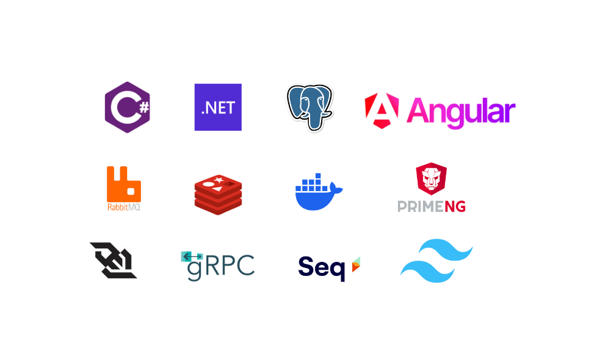

# Together.NET

## Introduction

⭐ A small forum project to support members to discuss, share and exchange experiences

## Technologies

## System Design

- Service.Identity: Related to users, roles and permissions 
- Service.Community: As the main domains, the main activities of the forum
- Service.Chat: Conversations between members
- Service.Notification: User or system activity notifications
- Service.Socket: Realtime support for Service.Chat and Service.Notification

## License

This project is licensed under the MIT License - see the [LICENSE](LICENSE) file for details.

Please note, all source code is publicly available. 

Absolutely do not use for trading purposes, please give me 1 ⭐ and cite me as a reference.