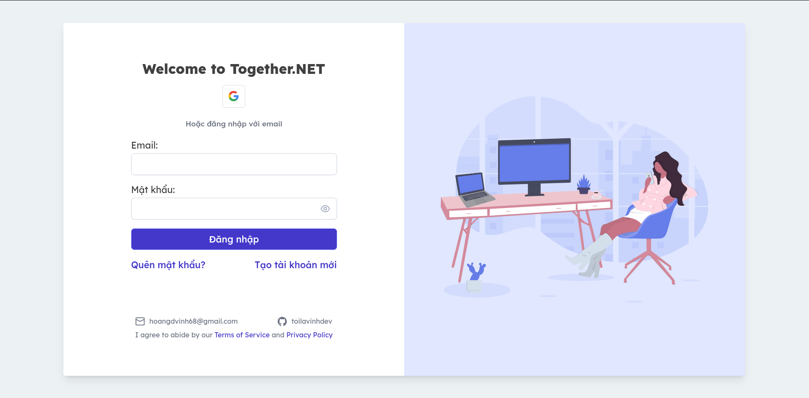

# Together.NET.v3

## Introduction

#### ⭐ A small forum project to support members to discuss, share and exchange experiences
#### ⭐ The project is upgraded from [Together.NET.v2](https://github.com/toilavinhdev/Together.NET.v2) based on Microservices Architecture

## Goals
- Built APIs with C# .NET 8 and UX/UI with Angular 17
- Implemented Vertical Slice Architecture to organize code base for each service
- Implemented the CQRS pattern with MediatR
- Used gRPC for synchronous communication between services
- RabbitMQ and Redis PubSub for asynchronous communication
- Real-time with WebSocket
- Used Redis as distributed cache
- Cloudinary for cloud storage

## Architecture Design

- Service.Identity: Related to users, roles and permissions
- Service.Community: As the main domains, the main activities of the forum
- Service.Chat: Conversations between members
- Service.Notification: User or system activity notifications
- Service.Socket: Realtime support for Service.Chat and Service.Notification

## Technologies

### Backend
- C# .NET 8
- PostgreSQL
- RabbitMQ
- gRPC
- Redis
- WebSocket
- YARP
- Docker
- Cloudinary
- Serilog

### Frontend
- Angular 17
- TypeScript, HTML, SCSS
- PrimeNG 17
- TailwindCSS
- Chart.js, Quill

### IDE & Text Editor
- Jetbrains Rider
- Jetbrains DataGrip
- Neovim

## License

This project is licensed under the MIT License - see the [LICENSE](LICENSE) file for details.